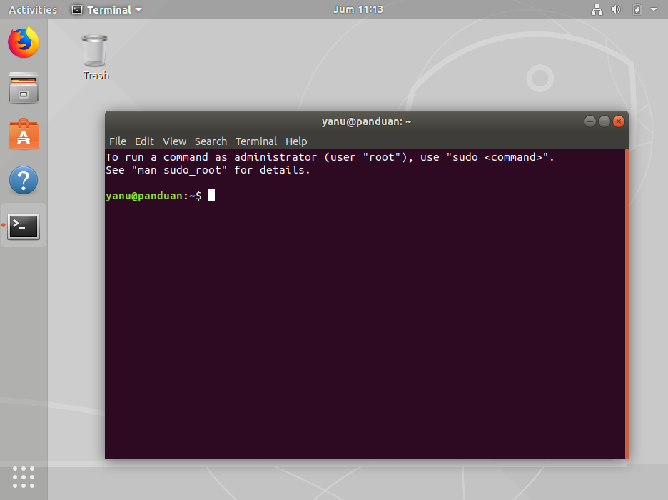

# Cara Menggunakan Linux


Panduan ini berisi cara praktis menggunakan linux untuk keperluan standar *programming*. Distro yang akan kamu gunakan adalah [ubuntu](https://www.ubuntu.com/desktop/developers). 

- [Alasan Menggunakan Ubuntu](#alasan-menggunakan-ubuntu)
- [Cara Install Ubuntu](#instalasi-ubuntu)
- [Cara Menggunakan Terminal](#cara-menggunakan-terminal)
  - [Cara install aplikasi](#cara-install-aplikasi)
  - [Cara Menggunakan Vim](#cara-menggunakan-vim)
  - [Contoh Penggunaan Command Line](#contoh-penggunaan-command-line)

 

## Alasan Menggunakan Ubuntu

  
*Source: Eclipse Community survey, 2014, Stackoverflow annual survey 2016*

Alasan utama memilih [ubuntu](https://pages.ubuntu.com/rs/066-EOV-335/images/Desktop_Developers_WP_Canonical_Final.pdf), adalah `freedom`. Kamu diperbolehkan men-*download* dan meng-*install*-nya tanpa membayar apapun. Ubuntu juga sudah menyediakan driver hardware standar (seperti USB, LAN, Wifi) dan driver untuk menjalankan file audio dan video (seperti MP3 dan AVI).

## Instalasi Ubuntu

> **Prasyarat**:  
> • Laptop tersambung dengan listrik  
> • Minimal punya space 5GB di hardisk   
> • Sudah memiliki Flash Disk yang berisi installer ubuntu. (Lihat: [cara membuat installer](https://tutorials.ubuntu.com/tutorial/tutorial-create-a-usb-stick-on-ubuntu))  
> • Backup semua data sebelum instalasi untuk jaga-jaga jika nanti ada kesalahan tidak disengaja   

Pada gambar di bawah ini terdapat tautan yang berisi bagaimana cara meng-install ubuntu. Klik dan ikuti saja langkah demi langkah.

[](https://tutorials.ubuntu.com/tutorial/tutorial-install-ubuntu-desktop)


## Cara Menggunakan Terminal

Di dalam Ubuntu versi desktop, sebenarnya sudah terdapat user-interface grafis untuk melakukan operasi-operasi standar, seperti install software, membuat dan men-delete folder & file, dsb. Tapi karena kamu ingin jadi developer, maka command-line di terminal, harus kamu ketahui. Akan ada banyak tools yang user-interface-nya memakainya. 



Berikut ini adalah perintah-perintah dasar yang biasa dipergunakan untuk keperluan sehari-hari. 

| Perintah | Keterangan |
|--|--|
| `mkdir`| *make directory*  |
| `cd`   | *change directory* |
| `pwd`  | *print working directory* |
| `ls`   | *list* |
| `sudo` | *super user do* |
| `apt`  | *advanced package tool* |
| `vim`  | *vi improved* |
| `cat`  | *concatenate* |
| `cp`   | *copy* |
| `rm`   | *remove* |

> **Catatan**:   
> Setiap command-line diawali dengan tanda `$` (dollar).  
> Barisan teks yang tidak diawali dengan `$` adalah hasil atau respon command-line.

## Contoh Penggunaan Command Line
Skenarionya kamu akan membuat direktori bernama `hello`. Masuk ke dalamnya, lalu membuat file bernama `hello.json`. 
Kamu lalu membuat salinan file tersebut ke file baru bernama `world.json`. Dan di akhir cerita, file tersebut kamu hapus.

Buat folder bernama `hello`.
```terminal
$ mkdir hello
```
Masuk ke folder bernama `hello`.
```terminal
$ cd hello
```

Cari tahu info tentang direktori kerja yang digunakan saat ini.
```terminal
$ pwd
```  

Hasilnya:
```terminal
/home/yanu/hello
```

Cari tahu isi sebuah folder bernama `/apt`
```terminal
$ ls /apt
```
Hasilnya:
```terminal
apt.conf.d  preferences.d  sources.list  sources.list.d  trusted.gpg  trusted.gpg.d
```

Buat file `hello.json` **(jika belum install vim, lihat [cara install aplikasi](#cara-install-aplikasi))**

  ```terminal
$ vim hello.json
```

Copy-paste dan save code berikut:
```json
{ 
  "text": "hello"
}
```

Quit.

Tampilkan isi `hello.json`.  
```terminal
$ cat hello.json
```

Jika perintah di atas kamu jalankan, hasilnya seperti ini:
```terminal
{ 
  "text": "hello"
}
```

Copy file `hello.json` ke file baru bernama `world.json`.  
```terminal
$ cp hello.json world.json
```

Kalau kamu ketik:
  ```terminal
  $ ls
  ``` 
Maka hasilnya seperti ini:
```terminal
hello.json  world.json
```
Terlihat, ada dua file.

Hapus (remove) file `world.json`
```terminal
$ rm world.json
  ```
  
## Cara Install Aplikasi

Untuk menginstall aplikasi, perintah yang digunakan adalah:
```terminal
$ sudo apt [nama_aplikasi]
```

`sudo` kependekan dari `SuperUserDo`. Digunakan untuk perintah yang memerlukan *`root's permission`*. `root` adalah user yang punya hak akses paling tinggi dalam sistem operasi ubuntu (administrator). 

`apt` adalah contoh perintah yang hanya bisa dilakukan oleh admin. Digunakan untuk menangani penambahan dan penghapusan perangkat lunak (package).

Misalnya kamu ingin coba membuat file bernama `hello.json` via terminal menggunakan file editor bernama `vim`. Tapi biasanya `vim` belum terpasang.

Coba ketik perintah:
```terminal
$ vim hello.json
```
Hasilnya:
```terminal
bash: vim: command not found
```

Maka kamu harus install dulu vim tersebut memakai `apt`:

```terminal
$ apt install vim  
```
Hasilnya:
```terminal
E: Could not open lock file /var/lib/dpkg/lock - open (13: Permission denied)
E: Unable to lock the administration directory (/var/lib/dpkg/), are you root?
```

### Cara install vim
Sekarang tambahkan `sudo` sebelum command line:
```terminal
$ sudo apt install vim
```
Hasilnya:
```terminal
Reading package lists... Done
Building dependency tree       
Reading state information... Done
The following additional packages will be installed:
  libpython3.6 vim-common vim-runtime xxd
Suggested packages:
  ctags vim-doc vim-scripts
The following NEW packages will be installed:
  libpython3.6 vim vim-common vim-runtime xxd
0 upgraded, 5 newly installed, 0 to remove and 19 not upgraded.
Need to get 8123 kB of archives.
After this operation, 37.3 MB of additional disk space will be used.
Do you want to continue? [Y/n]
```

Enter `Y` untuk melanjutkan proses.   
Setelah instalasi selesai, ketik perintah ini untuk memastikan instalasi berhasil:

```terminal
$ vim -version
```
Hasilnya:
```terminal
VIM - Vi IMproved 8.0 (2016 Sep 12, compiled Apr 10 2018 21:31:58)
Garbage after option argument: "-version"
More info with: "vim -h"
```
### Cara menggunakan vim  
Dengan asumsi kamu sudah [install vim](#contoh-penggunaan-sudo-dan-apt), ketik perintah berikut untuk step-by-step tutorial-nya.  
```terminal
$ vimtutor
  ```
Pastikan kamu paham perintah dasar ini sebelum lanjut.
