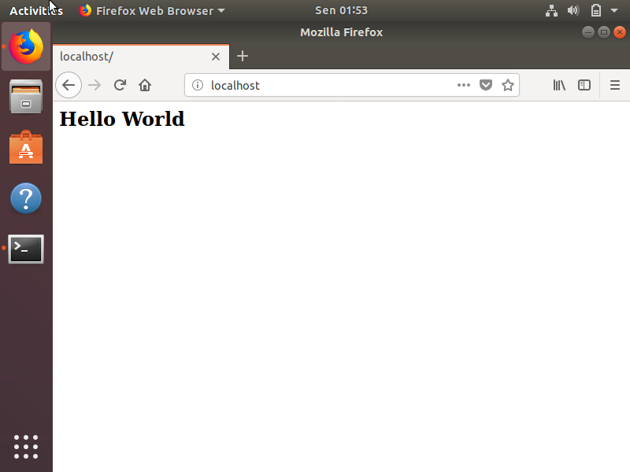

# Nginx Webserver

Nginx adalah aplikasi yang berguna sebagai server HTTP.

- [Cara Install Nginx](#cara-install-nginx)
- [Cara Menjalankan Nginx](#cara-menjalankan-nginx)
- [Konfigurasi Nginx](#konfigurasi-nginx)
- [Update Hak Akses User](#update-hak-akses-user)

## Cara Install Nginx

Dengan asumsi sudah [install ubuntu linux](linux/readme.md), berikut adalah cara installnya:

```terminal
$ sudo apt install nginx
```

## Cara Menjalankan Nginx

Untuk menjalankan nginx:
```terminal
$ sudo nginx
```

Buka browser dengan url http://localhost. Hasilnya:


Untuk menghentkan nginx:
```terminal
$ sudo nginx -s quit
```
## Konfigurasi Nginx

Buka file `/etc/nginx/sites-available/default`. Hapus semua konten. Lalu paste dan simpan konfigurasi berikut:
```nginx
server {
    root /var/www/html;
    index index.html;
    location / {
        try_files $uri $uri/ =404;
    }
}
```
Lokasi folder `root` ada di `/var/www/html`. Masuk ke dalamnya, buat file `index.html`

```terminal
$ cd /var/www/html
$ sudo vim index.html
```

Paste dan save kode html berikut:

```html
<html>
  <h2>Hello World</h2>
</html>
```

Buka `http://localhost` di browser. Hasilnya seperti ini:



## Update Hak Akses User

User yang aktif saat ini, tidak bisa secara langsung mengedit file-file di dalam folder `/var/www/html`. Folder tersebut terbuat saat instalasi nginx. Secara default, folder tersebut milik user dan grup `www-data`.

Agar user yang aktif bisa mengganti konten `root` folder, maka kamu harus tambahkan user tersebut menjadi anggota grup `www-data` -- dan mengganti ownership folder ke grup `www-data`. 

Caranya:

```terminal
$ sudo usermod -a -G www-data $USER
$ sudo chown $USER:www-data -R /var/www/html
```

Dengan cara ini, kamu tidak perlu memakai `sudo` lagi jika ingin mengubah konten root dalam folder.
