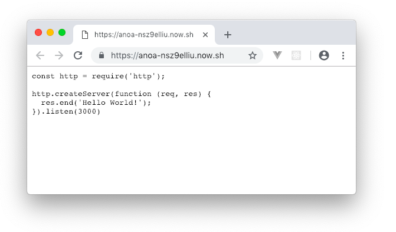
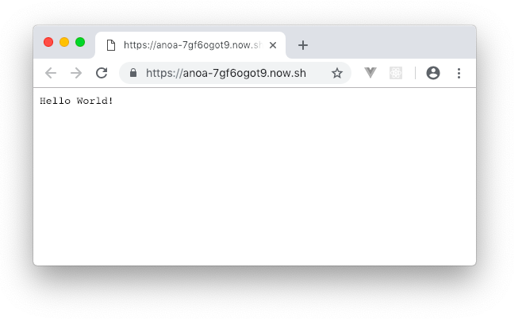

# Persiapan

Untuk memperkecil perbedaan lingkungan kerja dan menghemat waktu, disarankan untuk menggunakan sistem operasi [Ubuntu](https://tutorials.ubuntu.com/tutorial/tutorial-install-ubuntu-desktop). Semua intruksi instalasi command line panduan ini seharusnya berjalan dengan baik di atasnya.

- [Install Node.js](#install-node.js)
- [Node.js Hello World](#node.js-hello-world)
- [Menjalankan Web Server dengan NPM](#Menjalankan-Web-Server-dengan-NPM)

## Install Node.js

![nodejs][nodejs]

```terminal
$ curl -sL https://deb.nodesource.com/setup_10.x -o nodesource_setup.sh
$ sudo bash nodesource_setup.sh 
$ sudo apt-get install -y nodejs
```
Cek hasil instalasi dengan perintah berikut.
```terminal
$ node --version
v10.14.2
```

```terminal
$ npm --version
6.4.1
```
Untuk sistem operasi lain, silahkan cek intruksinya di sini:
[https://nodejs.org/en/download/package-manager/](https://nodejs.org/en/download/package-manager/)

# Node.js Hello World

Masuk terminal, lalu buat folder `anoa` dan masuk ke dalamnya. (Kamu juga bisa menggunakan nama selain `anoa`).

```terminal
$ mkdir anoa && cd anoa
```

Kita akan membuat server paling sederhana. Buat file bernama `index.js`.
```terminal
$ code index.js
```

Paste code berikut:
```javascript
const http = require('http');

http.createServer(function (req, res) {
  res.end('Hello World!');
}).listen(3000);
```

Buka terminal lagi, dan jalankan web servermu dg perintah ini:
```terminal
$ node index.js
```

Buka browser, visit http://localhost:3000, maka kamu akan melihat tulisan 'Hello World'.


Sedangkan kalau dilihat pakai [`curl`](https://curl.haxx.se/docs/httpscripting.html)

```terminal
$ curl --include http://localhost:3000
HTTP/1.1 200 OK
Date: Sat, 22 Dec 2018 03:11:59 GMT
Connection: keep-alive
Content-Length: 12

Hello World!
```

## Menjalankan Web Server dengan NPM

Buat file `package.json` dengan perintah berikut:
```terminal
$ npm init -y
```

Jika kamu buka file `package.json`, hasilnya seperti ini:
```json
{
  "name": "anoa",
  "version": "1.0.0",
  "description": "",
  "main": "index.js",
  "scripts": {
    "test": "echo \"Error: no test specified\" && exit 1"
  },
  "keywords": [],
  "author": "",
  "license": "ISC"
}
```

Edit file `package.json` dengan command berikut:
```terminal
$ code package.json
```

Update menjadi seperti ini:
```json
{
  "name": "anoa",
  "version": "1.0.0",
  "description": "",
  "main": "index.js",
  "scripts": {
    "start": "node index.js",
    "test": "echo \"Error: no test specified\" && exit 1"
  },
  "keywords": [],
  "author": "",
  "license": "ISC"
}
```

Jalankan web server dengan command ini:
```terminal
$ npm start
> anoa@1.0.0 start /Users/yanu/Documents/learn-nodejs/anoa
> node index.js

```

## Deploy ke Zeit Server

Pastikan kamu sudah install tool `Git` dan `Now` serta sudah terdaftar di Github dan Zeit.  

Buka terminal. Masuk ke terminal zeit dengan perintah berikut:

```terminal
$ now login
```
Kamu akan diminta memasukkan email. Masukkan yang sudah terdaftar sebelumnya.

```terminal
> Enter your email: awesome_email_ox790@gmail.com
```
Tekan enter, nanti akan muncul keterangan semacam ini:

```terminal
> We sent an email to awesome_email_ox790@gmail.com. Please follow the steps provided
  inside it and make sure the security code matches Helpful Cougar.
⠧ Waiting for your confirmation
```

Buka email, dan ikuti intruksinya.


Setelah link kamu click, akan muncul tab baru dengan tampilan seperti ini:


Dan tampilan di terminal `now` akan seperti ini:
```terminal
✔ Email confirmed
> Ready! Authentication token and personal details saved in "~/.now"
```

Sekarang saatnya kita deploy. Ketik command berikut:
```terminal
$ now
```
Hasilnya:
```terminal
> WARN! Your project is missing a now.json file with a `version` property. More: https://zeit.co/docs/version-config
> Deploying ~/Documents/learn-nodejs/anoa under awesome_email_ox790@gmail.com
> Synced 4 files (76.04KB) [3s]
> https://anoa-nsz9elliu.now.sh/ [v2] [in clipboard] [2s]
┌ **        Ready               [758ms]
├── package.json
└── index.js
> Success! Deployment ready [4s]
```

Visit: [https://anoa-nsz9elliu.now.sh/](https://anoa-nsz9elliu.now.sh/)  
Nanti akan tampak source-code `index.js`. 



Tentu saja ini masih salah, karena harusnya tampilannya berisi 'Hello World' seperti di `localhost`.

Buat file `now.json`. File ini berisi konfigurasi aplikasi di zeit.
```terminal
$ code now.json
```

Paste dan save kode berikut:
```json
{
  "version": 2,
  "builds": [
    { "src": "index.js", "use": "@now/node-server" }
  ],
  "routes": [
    { "src": "/(.*)", "dest": "/index.js" }
  ]
}
```

Deploy lagi:

```terminal
$ now
> Deploying ~/Documents/learn-nodejs/anoa under awesome_email_ox790@gmail.com
> Synced 1 file (79.88KB) [2s]
> https://anoa-7gf6ogot9.now.sh [v2] [in clipboard] [1s]
┌ index.js        Ready               [13s]
└── λ index.js (2.58KB) [sfo1]
> Success! Deployment ready [15s]
```

Sekarang, visit [https://anoa-7gf6ogot9.now.sh](https://anoa-7gf6ogot9.now.sh).



[nodejs]: https://nodejs.org/static/images/logos/nodejs-new-pantone-black.png
